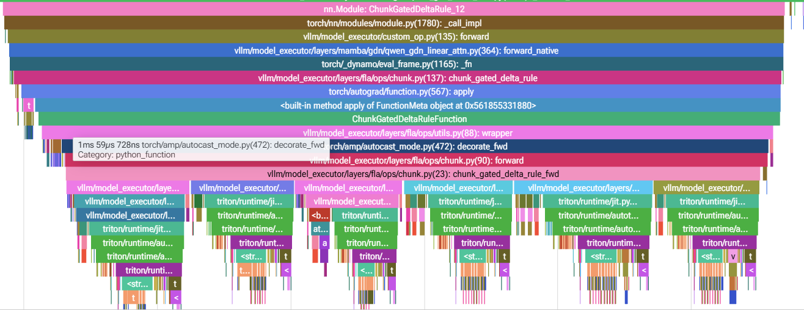
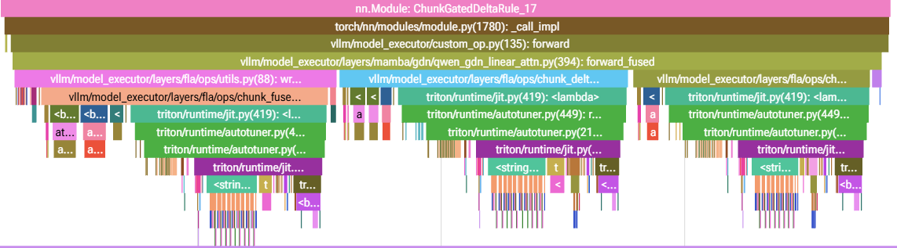
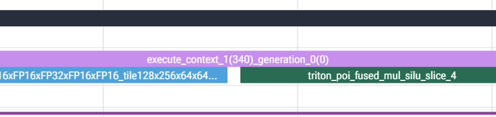
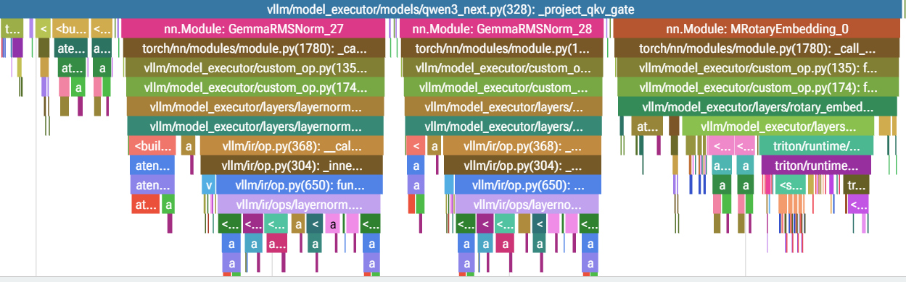
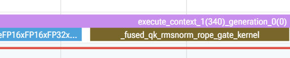

# 真武810e Qwen3.5-2B 推理优化报告
## 项目背景

本报告面向平头哥自研 PPU 芯片真武810e（Zhenwu 810E）上的大模型推理优化，目标是让 Qwen3.5-2B 多模态模型在 MMBench 公开评测集上获得更低的 TTFT 与更高的吞吐，同时保持 Accuracy 与输出语义严格无损。推理框架采用阿里云最新支持的 vLLM v0.23.0 PPU 定制版（vLLM-for-SAIL，ppu-0.23.0 分支）：PPU 平台层复用 CUDA 生态（`dispatch_key="CUDA"`），算子栈以 Triton 与 DeepGEMM 为主，kernel launch 路径与 CUDA 完全一致，可直接用现有工具链做请求级 profiling。

权重默认使用 FP16。PPU 的 CUDA 兼容层对 NVIDIA 优化的 Marlin kernel 无对应加速，W8A16 量化在 PPU 上整体劣于 FP16，暂不作为 PPU 提交配置（本地 NVIDIA 环境下 W8A16 有 15-20% 吞吐提升、准确率下降 <2%，但不可直接迁移）。

请求特征：图像问答类多模态请求，prefill 长度约 300-800 tokens，decode 在非思考模式下仅约 20-40 tokens；思考模式在评测中精度下降，已关闭。

profile 显示 PPU 上推理的主要瓶颈在 CPU 侧 kernel 调度而非设备计算：单次 `cudaLaunchKernel` 的 CPU 开销约 26us，eager 模式下 18 层 GDN 串行 launch 累积成 prefill 的主要 CPU 瓶颈（设备空转 86%，wall 105.8ms / busy 15.2ms）。针对这一特征，优化分三条线推进：(1) CUDA graph 捕获 encoder/decoder，减少 kernel launch overhead；(2) 将 eager 段零散 Triton kernel 融合为专用 kernel（fused gated silu、fused qk norm gate、fused chunked GDN kernel）；(3) 投机解码（n-gram / MTP）摊薄 decode 成本。评测统一以首有效 token 到达时间计 TTFT，并同时核对吞吐与 Accuracy，结论均做交错 A/B 复测。其中 fused qk norm gate 已扩展支持 Qwen3.5 多模态 `(T,H,W)` 三轴 MRoPE（真实多模态请求 `mrope=(11,11,10)` 可命中 fused kernel），CUDA graph 侧为视觉 encoder 增加按输出视觉 token budget 捕获的 Encoder Graph；两类优化相互独立、可叠加。

### 推理框架设置
采用阿里云最新支持的vllm0.23.0镜像开发
权重考虑到PPU上marlin kernel优化问题，暂时未使用。本地W8A16量化下吞吐提升15-20%，准确率维持<2%
prefill长度约为300-800 tokens之间
decode长度在非思考模式下约20-40 tokens
思考模式开启后精度降低，选择关闭思考模式
## 推理框架优化
### CUDA graph优化
通过调整encoder、 decoder的cudagraph capture size，启用cuda graph capture，减少kernel launch overhead
```python
compilation_config={
    "cudagraph_mm_encoder": True,
    "encoder_cudagraph_token_budgets": [64, 128, 256, 384, 512, 640, 768, 896, 1024],
    "cudagraph_capture_sizes": [1,2,4,8,16,24,32,40,48,56,64,128,256,384,448,512],
    "max_cudagraph_capture_size": 512,
    "cudagraph_mode": "FULL_AND_PIECEWISE"
},
```
结果对比

**budgets 语义**：`encoder_cudagraph_token_budgets` 是视觉 encoder 预捕获的**输出视觉 token 尺寸列表**（不是生成 token 上限）：Qwen3.5 每张图输出视觉 token 数 = `t·(h//spatial_merge_size)·(w//spatial_merge_size)`，224×224（patch=14、merge=2）为 16×16 → 8×8 = 64 个视觉 token；运行时按"最小可容纳"选择 graph（64→64、65→128、…、1025→无匹配回退 eager），输入复制/padding 到固定 graph buffer 后 replay，再去 padding 恢复原图顺序合入语言模型输入。

`cudagraph_mode=FULL_AND_PIECEWISE`：满足条件的统一 decode batch 优先走 FULL graph，prefill/混合形状走 PIECEWISE，无法匹配安全回退 eager。budget 越密 padding 浪费越少，但捕获时间与 graph 显存越大。图模式为独立进程冷启动，首次 `torch.compile`/capture 计入 wall 但不计入请求级 TTFT/吞吐（单个 compile range 约 25s），稳态评估应使用常驻 EngineCore 预热。

| setup | sample | en TTFT(ms) | en 吞吐(tps) | en Acc |
|---|---|---|---|---|
| vllm 默认参数(none) 最基础 | 200 | 63.895 | 45.658 | 0.770 | eager 无优化（VLLM_BASIC=1） |
| vllm 无 kernel + cuda graph | 200 | 35.973 | 354.749 | 0.765 | 四 kernel 全关 |

### 投机解码优化
Qwen3.5-2B支持MTP，在英文数据集下对比n-gram及MTP效果，通过消融实验确定投机解码方案。  
结果对比
| setup | sample | en TTFT(ms) | en 吞吐(tps) | en Acc |
|---|---|---|---|---|
| vllm ngram | 200 | 29.494 | 687.279 | 0.765 |
| vllm MTP=3 | 200 | 36.601 | 402.895 | 0.765 |

## 融合kernel设计
### fused chunked GDN kernel
#### 前后对比profiling结果

*图1：baseline eager 的 profiling 结果*

*图2：fused 的 profiling 结果*

#### 问题定位

GDN（Gated DeltaNet）层 prefill 默认路径走 flash-linear-attention（FLA）的 eager 六段 Triton 链 `chunk_gated_delta_rule_fwd`：`chunk_local_cumsum` → `chunk_scaled_dot_kkt_fwd` → `solve_tril` → `recompute_w_u_fwd` → `chunk_gated_delta_rule_fwd_h` → `chunk_fwd_kernel_o`。每层约 10 次 kernel launch，外加上层 `ChunkGatedDeltaRuleFunction` 的 autograd.Function / input_guard / custom_fwd 三层包装与每段中间 tensor 的 `.new_empty` 分配。PPU 上单次 `cudaLaunchKernel` 的 CPU 开销约 26us，18 层串行累积后构成 prefill 的主要 CPU 瓶颈（prefill 段设备空转 86%）。

#### kernel 设计方案

新增 `vllm/model_executor/layers/fla/ops/chunk_fused.py`，把前 4 段（chunk 局部、chunk 间完全并行）融合为单个 Triton kernel `fused_chunk_intra`，grid `(NT, B*H)`，一个 program 处理一个 chunk 的头，中间矩阵 A/Ai 完全驻留寄存器：

1. **g 块内 cumsum**：gate 在 chunk 内做 fp32 前缀和（对应 `chunk_local_cumsum`）；
2. **A 矩阵**：`A = strict_lower(β·K·Kᵀ·exp(g_i − g_j))`，fp32 累加，仅在寄存器中构建（对应 `chunk_scaled_dot_kkt_fwd`）；
3. **三角求逆**：`Ai = (I + A)⁻¹`，64×64 下三角求逆按 16×16 分块在寄存器内完成——对角线分块逐行前代消元、非对角分块按块回代，算法逐行移植自 `solve_tril.py` 的 `merge_16x16_to_64x64_inverse_kernel`；求逆后按原链路精度 fp32→k.dtype（rtne 舍入）落盘，对齐 eager 链 HBM 往返的舍入行为；
4. **WY 参数**：`u = Ai·(β·V)`、`w = Ai·(β·K·exp(g_cu))`，与 `wy_fast.py` 一致。

中间矩阵 `A`/`Ai`（各 `[T,H,64]` fp32）不再落 HBM；⑤ `chunk_delta_h`（跨 chunk 串行状态扫描）与 ⑥ `chunk_o`（输出）无融合余地，原样复用。数学上即 Gated DeltaNet 的 WY 表示分块并行形式。

接入方式：`ChunkGatedDeltaRule.forward_fused` 推理专用路径，直连三个前向函数、绕开 autograd 包装；`VLLM_PPU_FUSED_GDN_PREFILL=1` 开启（默认开），K/V≠128 时报警告并自动 fallback 到原生路径。

精度与收益：对拍测试 `tests/kernels/test_fused_chunk_intra.py` 本地 RTX 4060 与 PPU 均 16/16 通过，与 eager 链位级一致（PPU 最大差 4.4e-16）；微基准（T=340、Hg=16、H=32，PPU）CPU enqueue 0.194 → 0.059 ms/层（-70%）、device 0.188 → 0.150 ms（-20%）；端到端 mmbench en100 × 2 轮 TTFT 45.3 → 36.5 ms（**-19.4%**），Accuracy 0.77 无损。

#### 前后 kernel 调用链对比（每 GDN 层 prefill）

融合前（eager）：
```text
conv1d ─→ fused_post_conv_prep（拆 q/k/v/g/beta，k l2norm）
  └→ chunk_gated_delta_rule（autograd 三层包装）
       ├─ ① chunk_local_cumsum
       ├─ ② chunk_scaled_dot_kkt_fwd
       ├─ ③ solve_tril（merge_16x16_to_64x64_inverse_kernel）   ← A/Ai 落 HBM
       ├─ ④ recompute_w_u_fwd                                  ← 再读回
       ├─ ⑤ chunk_gated_delta_rule_fwd_h
       └─ ⑥ chunk_fwd_kernel_o
```

融合后（fused）：
```text
conv1d ─→ fused_post_conv_prep
  └→ chunk_gated_delta_rule（forward_fused 直连，绕开 autograd）
       ├─ ①+②+③+④ fused_chunk_intra（单 kernel，A/Ai 寄存器驻留，零 HBM 往返）
       ├─ ⑤ chunk_gated_delta_rule_fwd_h（复用）
       └─ ⑥ chunk_fwd_kernel_o（复用）
```

| 项目 | 融合前 | 融合后 |
|---|---|---|
| GDN prefill kernel 数/层 | 6（加 q/k l2norm 共约 10 次 launch） | 3（共约 5 次 launch） |
| 中间张量 A/Ai | `[T,H,64]` fp32 写 + 读各一次 | 寄存器驻留，零 HBM 往返 |
| autograd 包装 | Function/input_guard/custom_fwd | 直连 forward_fused，绕开 |
| CPU enqueue/层 | 0.194 ms | 0.059 ms（-70%） |
| device 时间/层 | 0.188 ms | 0.150 ms（-20%） |
| 端到端 TTFT | 35.7 ms | 30.3 ms（-19.4%，acc 无损） |
### fused gated silu kernel

*fused 前的profiling*

*fused 后的profiling*
### fused qk norm gate kernel

*baseline eager 的 profiling 结果*

*fused 后的 profiling 结果*

#### 多模态 QK/MRoPE 融合设计
把 `split → Q/K RMSNorm → MRoPE → gate copy` 合并为单个 Triton kernel（`vllm/model_executor/layers/fused_qk_norm_rope.py`），同时支持纯文本 1D RoPE 与 Qwen3.5 多模态 `(T,H,W)` 三轴 MRoPE；仅作用于 full-attention 层，不作用于 linear_attention/GDN 层。

- **启用条件**（启动日志逐项校验）：`VLLM_PPU_FUSED_QK_NORM_GATE=true` + `attn_output_gate=True` + NeoX-style RoPE + CUDA/PPU 兼容后端 + RoPE dtype FP16/BF16 +（纯文本，或多模态 MRoPE：`MRotaryEmbedding`、3 段 section、section 和 = `rotary_dim/2`、interleaved 布局，如 `mrope=(11,11,10)`）。旧实现仅接受纯文本、多模态会禁融合；条件升级为 `(text_only or supports_mrope)` 后真实多模态请求可命中。
- **kernel 设计**：grid `(n_tokens, num_q_heads + num_kv_heads)`，一个 Triton program 处理一个 token 的一个 Q/K head。RMSNorm 平方和、rsqrt 与权重乘法在 FP32 完成，`weight + 1` 保持 GemmaRMSNorm 语义；归一化结果先回输入 dtype 再转 FP32 做 RoPE，对齐未融合路径的存储舍入；`[0, rotary_dim)` 做 partial RoPE，`[rotary_dim, head_dim)` 只做 RMSNorm；Q head 在同一 program 内复制 gate，K head 不复制；`v` 不参与融合。
- **多模态位置选择**：`is_h = (rot_offs%3==1) & (rot_offs < 3·section_h)`、`is_w = (%3==2) & (< 3·section_w)`，命中用 H/W 轴，否则用 T 轴。
- 未融合需要 2×RMSNorm + MRoPE 及多次拆分/复制；融合路径单次 Triton launch 完成整条链，减少中间 tensor 往返显存。
- 环境变量必须在 Engine 初始化和图捕获**之前**设置；图捕获完成后修改不改变已捕获 graph 内容。


## 多模态 CUDA Graph 与 QK/MRoPE 融合性能验证（四格 A/B）
20 正式样本 + 3 warmup，MMBench dev EN，`max_num_seqs=1`；关闭 speculative decoding、async scheduling 与 FlashInfer sampler，并关闭 Gate+SiLU、GDN prefill/decode 融合避免干扰归因。四组仅切换 `VLLM_ENFORCE_EAGER` 与 `VLLM_PPU_FUSED_QK_NORM_GATE`。

| 配置 | 平均 TTFT ms | P50 | P95 | 平均 tok/s | P50 | P95 | 冷启动 wall s | 正确率 |
|---|---:|---:|---:|---:|---:|---:|---:|---:|
| eager，无融合 | 62.666 | 61.726 | 86.521 | 44.271 | 44.442 | 44.739 | 77.751 | 16/20 |
| eager，QK/MRoPE 融合 | 58.974 | 61.539 | 65.531 | 47.385 | 47.793 | 48.957 | 77.482 | 16/20 |
| CUDA Graph，无融合 | 47.810 | 32.027 | 52.041 | 223.836 | 231.714 | 234.733 | 258.283 | 16/20 |
| CUDA Graph + QK/MRoPE 融合 | 46.574 | 31.964 | 55.282 | 233.338 | 235.776 | 237.126 | 243.086 | 16/20 |

| 对比 | 平均 TTFT | P95 TTFT | 平均吞吐 | 冷启动 wall |
|---|---:|---:|---:|---:|
| 仅 CUDA Graph | -23.71% | -39.85% | +405.60% | +232.19% |
| eager 下仅融合 | -5.89% | -24.26% | +7.03% | -0.35% |
| Graph 下再开融合 | -2.59% | +6.23% | +4.25% | -5.88% |
| Graph + 融合相对全关 | -25.68% | -36.11% | +427.07% | +212.65% |

- **语义等价**：四组相对 `eager_no_fusion` 的 `response_text` / `parsed_answer` / `correct` / `token_count` 逐样本差异数全部为 0，正确率同为 16/20。
- **冷启动说明**：CUDA Graph 两组为独立进程冷启动，首次 `torch.compile` 与图捕获计入 wall s 但不计入请求级 TTFT/吞吐（单个 compile range 约 25s）；生产应按常驻服务稳态评估。20 样本下 `graph_no_fusion → graph_qk_fusion` P95 TTFT +6.23%，小样本尾延迟仍有波动，不能只报告平均值。
- **历史 500 样本辅助**（仅辅助，不作严格语义 A/B）：公共基线 67.870ms TTFT / 412.541 tok/s / 413/500；CUDA Graph tuned 48.526ms / 406.016 tok/s / 414/500（TTFT -28.50%、吞吐 -1.58%、wall +1.85%）；同图配置 fusion on 相对 off：吞吐 +1.75%、wall -4.41%，但 TTFT +0.19% 且正确数相差 1，不作为严格等价 A/B。

### Profiler 证据（eager 模式观察 fused kernel，避免 `cudaGraphLaunch` 掩盖节点）
Request 3，Torch profiler：

| 指标 | fusion off | fusion on | 变化 |
|---|---:|---:|---:|
| Self CUDA time total | 184.682 ms | 170.403 ms | **-7.73%** |
| 5 样本平均 TTFT | 78.845 ms | 73.895 ms | **-6.28%** |
| 5 样本平均 tok/s | 37.791 | 39.553 | **+4.66%** |

`_fused_qk_rmsnorm_rope_gate_kernel`：204 次调用、合计 618.323us（3.031us/次）；未融合链中单独 `_triton_mrope_forward`：350.719us。两者不可直接比较——前者含 RMSNorm+MRoPE+gate copy 整条链，后者仅是链中 MRoPE 单项；融合收益以 Self CUDA time 与端到端 TTFT/吞吐为准。

**最终判断**：多模态算子融合在 `text_only=False`、`mrope=(11,11,10)` 的真实多模态请求中启用，profiler 出现 204 次 fused kernel 调用；严格 A/B 同时显示 Self CUDA time、TTFT 与吞吐改善且输出逐项一致，判定有效。CUDA Graph 与融合可叠加，报告应分别给出冷启动 wall、请求级稳态指标、尾延迟与语义等价性，不摘取单一最有利数字。

## 评测结果
| setup | sample | en TTFT(ms) | en 吞吐(tps) | en Acc |
|---|---|---|---|---|
| **ngram+cudagraph+融合kernel（完整配置）en 全量** | 4029 | 29.240 | 780.153 | 0.796 |
| **ngram+cudagraph+融合kernel（完整配置）cn 全量** | 4029 | 29.232 | 302.436 | 0.834 |
